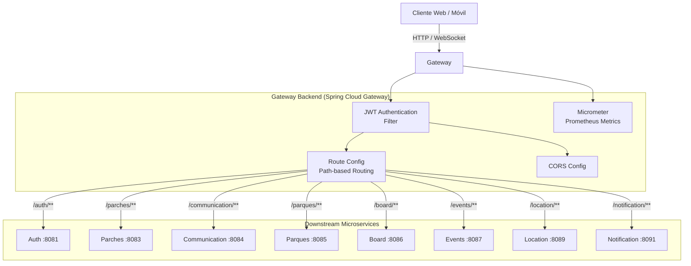
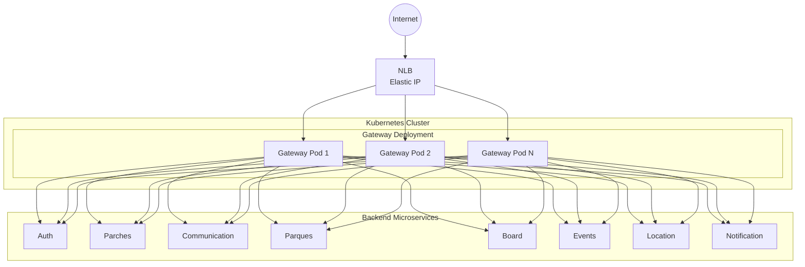

# Gateway Backend Microservice

Este microservicio es el punto de entrada único (single entry point) para todas las solicitudes HTTP y WebSocket de la plataforma U-Link. Implementa un API Gateway utilizando Spring Cloud Gateway que maneja el enrutamiento, la validación JWT, la configuración CORS, y la métrica de tráfico. Forma parte del ecosistema **PATRICIA** y actúa como la puerta de enlace hacia los 9 microservicios backend.

## ¿Qué hace el microservicio?

1. **Enrutamiento Inteligente:** enruta las solicitudes HTTP y WebSocket a los microservicios backend correspondientes basándose en el path del request. Cada microservicio tiene su ruta configurada (auth, parches, events, board, location, communication, parques, notification).
2. **Validación JWT Centralizada:** Interceptor de seguridad que valida los tokens JWT en cada request antes de enrutarlo al microservicio destino. Verifica la firma, expiración y claims del token.
3. **Gestión CORS:** Configuración centralizada de Cross-Origin Resource Sharing para permitir solicitudes desde el frontend web y móvil.
4. **Proxy de WebSocket:** Enruta conexiones WebSocket/STOMP a los microservicios que soportan comunicación en tiempo real (board, location, communication, parques).
5. **Métricas y Monitoreo:** Expone métricas de Prometheus a través de Micrometer para monitoreo de tráfico, latencia y salud del gateway con Grafana.

---

## Parámetros de Calidad y Principios de Diseño

* **Principios SOLID:**
  * *Single Responsibility Principle (SRP):* Separación clara entre enrutamiento (`RouteConfig`), validación JWT (`JwtAuthenticationFilter`, `JwtService`), seguridad (`SecurityConfig`) y métricas.
  * *Dependency Inversion Principle (DIP):* Uso de inyección de dependencias a través de constructores inyectados.
* **Alta Disponibilidad y Escalabilidad Horizontal:** Gateway stateless, escalable horizontalmente. Configurado con HPA (2-6 replicas) y PodDisruptionBudget (minAvailable=1).
* **Tolerancia a Fallos:** *Health Probes* (liveness, readiness) a través de Spring Boot Actuator, con endpoints públicos `/actuator/health` y `/actuator/prometheus`.
* **Testing y Code Coverage:** *Coverage Gate* con JaCoCo (mínimo 80% en líneas).

---

## Diagrama de Arquitectura



---

## Diagrama de Despliegue



## Rutas de Enrutamiento

| Path Pattern | Target Service | Port |
|-------------|----------------|------|
| `/auth/**` | Auth Backend | 8081 |
| `/parches/**` | Parches Backend | 8083 |
| `/communication/**` | Comunicacion Backend | 8084 |
| `/parques/**` | Parques Backend | 8085 |
| `/board/**` | Board Backend | 8086 |
| `/events/**` | Events Backend | 8087 |
| `/location/**` | Location Backend | 8089 |
| `/notification/**` | Notification Backend | 8091 |

**Rutas públicas** (sin autenticación JWT):
- `/auth/**`
- `/actuator/health`
- `/actuator/info`
- `/actuator/prometheus`
- `/api/games/**`
- `/parques-ws/**`
- `/ws/board/**`

## Tecnologías Principales

* Java 21
* Spring Boot 3.5.16
* Spring Cloud Gateway 2025.0.3 (WebFlux)
* Spring Security
* JJWT 0.12.6 (JWT Validation)
* Micrometer + Prometheus (Metrics)
* Spring Boot Actuator
* Reactor Test
* JaCoCo (Coverage)

## API Documentation

The Gateway does not expose its own API docs — it acts as a transparent proxy. Each downstream microservice exposes its own OpenAPI/Swagger UI:
```
http://<HOST>:<PORT>/<service-path>/swagger-ui.html
```

## Running Locally

### Prerequisites
- Java 21 (or newer)
- Maven 3.9+
- Access to the downstream microservices (Auth, Parches, etc.)

### Steps
1. Clone the repository and navigate to the project root.
2. Set the required environment variables (see *Configuration* section below).
3. Build the project:
   ```
   ./mvnw clean package
   ```
4. Run the application:
   ```
   java -jar target/gateway-0.0.1-SNAPSHOT.jar
   ```
   The service will start on port **8080** by default.

## Docker Deployment

A Dockerfile is provided for containerizing the microservice. Build and run the image with:
```bash
docker build -t gateway-backend:latest .

docker run -d \
  -p 8080:8080 \
  -e "SPRING_PROFILES_ACTIVE=prod" \
  -e "JWT_SECRET=your-secret-key" \
  -e "CORS_ALLOWED_ORIGINS=https://your-frontend.com" \
  gateway-backend:latest
```

A `docker-compose.yml` is also provided for local development, routing to downstream services via `host.docker.internal`:
```bash
docker-compose up -d
```

## Configuration

The service requires the following environment variables:

| Variable | Description | Required |
|----------|-------------|----------|
| `JWT_SECRET` | Secret key for JWT validation (shared with Auth service) | Yes |
| `CORS_ALLOWED_ORIGINS` | Comma-separated list of allowed CORS origins | Yes |
| `AUTH_SERVICE_URL` | URL of the Auth service | Yes |
| `PARCHES_SERVICE_URL` | URL of the Parches service | Yes |
| `COMMUNICATION_SERVICE_URL` | URL of the Communication service | Yes |
| `BOARD_SERVICE_URL` | URL of the Board service | Yes |
| `EVENTS_SERVICE_URL` | URL of the Events service | Yes |
| `LOCATION_SERVICE_URL` | URL of the Location service | Yes |
| `PARQUES_SERVICE_URL` | URL of the Parques service | Yes |
| `NOTIFICATION_SERVICE_URL` | URL of the Notification service | Yes |

## Monitoring

The service exposes Prometheus metrics at `/actuator/prometheus`. A pre-built Grafana dashboard is available at `deploy/dashboards/gateway-dashboard.json` for monitoring:
- Request rate and latency per route
- Error rates
- Active WebSocket connections
- JVM metrics

## Testing

Unit and integration tests are located under `src/test/java`. Run the full test suite with:
```bash
./mvnw verify
```
Coverage is enforced by JaCoCo with a minimum of **80%** line coverage.

## Contributing

Contributions are welcome! Please follow these steps:
1. Fork the repository.
2. Create a feature branch (`git checkout -b feature/awesome-feature`).
3. Implement your changes, ensuring existing tests pass and adding new tests if needed.
4. Submit a Pull Request with a clear description of the changes.

All contributions must adhere to the project's coding standards and pass the CI pipeline.

## License

This project is licensed under the **Apache License 2.0**. See the `LICENSE` file for details.
